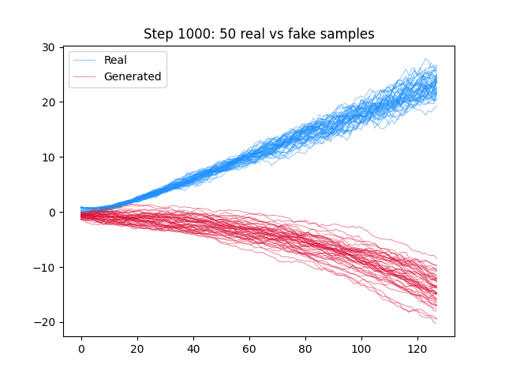

# Infinite GANs Demo

A showcase of the current capabilities of Infinite GANs.

## Basic Example: Ornstein-Uhlenbeck Process

As a basic demonstration, Infinite GAN is applied to learn and generate samples from an Ornstein-Uhlenbeck (OU) process, a classical mean-reverting stochastic process often used in time-series modeling.

To execute this, run the following line in the terminal:

```bash
python -m src.run
```

The model is trained for 10,000 steps using batches of 1,024 samples, each consisting of 128 time steps. During training, Infinite GAN generates synthetic samples every 1,000 steps, allowing us to monitor its learning progression.

<p align="center">
  
  <i style="color:gray;"><br>Fig. 1) Comparison of real and generated samples from the Ornstein-Uhlenbeck process over training iterations</i>
</p>

The synthetic samples increasingly resemble the real OU process as training progresses. This is quantitatively reflected in the Wasserstein loss, which measures the distance between the distributions of real and generated data.

<p align="center">
  
  <i style="color:gray;"><br>Fig. 2) Wasserstein loss over training steps</i>
</p>

This graph represents the difference between discriminator's scores for the fake and real samples. The evolution of the discriminator’s mean scores for real versus fake samples is shown below:

<p align="center">
  
  <i style="color:gray;"><br>Fig. 3) Mean discriminator scores for real vs. fake samples</i>
</p>

In both Fig. 2 and Fig. 3, convergence is observed around the 3,000-step mark. Specifically, Fig. 3 shows the real and fake mean scores aligning, while Fig. 2 shows the Wasserstein loss approaching zero, indicating that the discriminator is increasingly unable to distinguish between the two distributions.

## Training Dataset:

## Urban Datatset:
