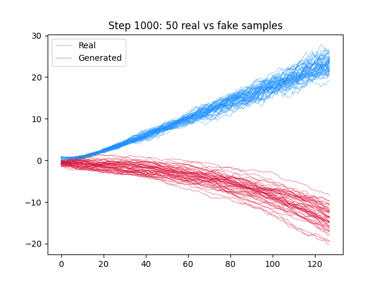
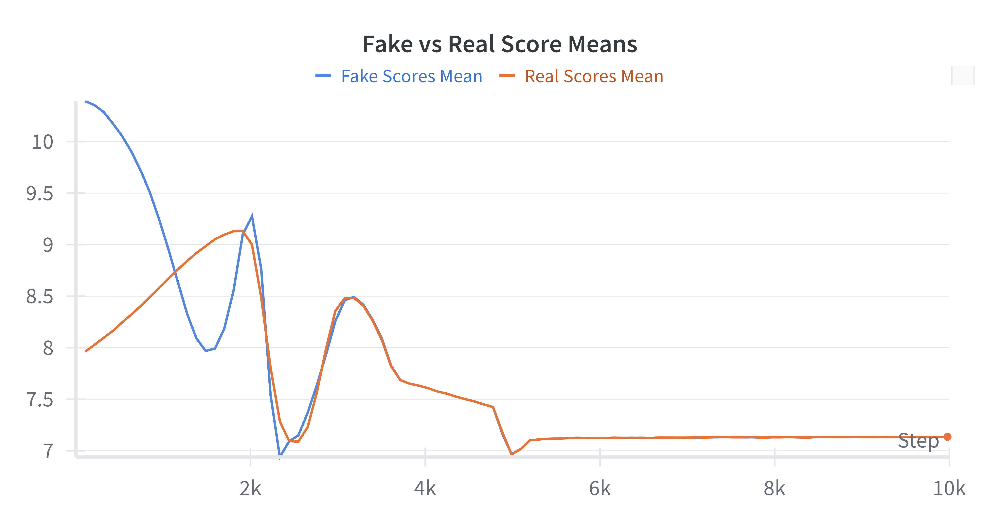
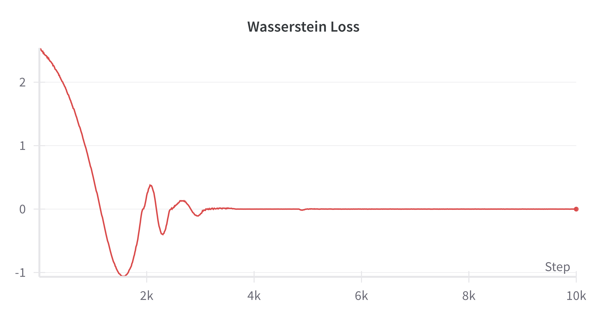
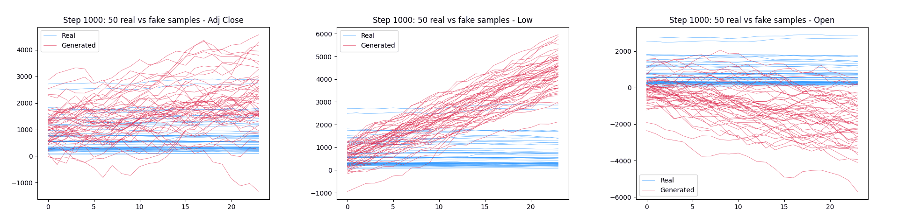
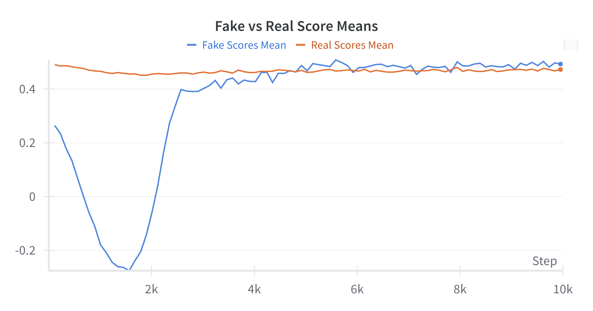
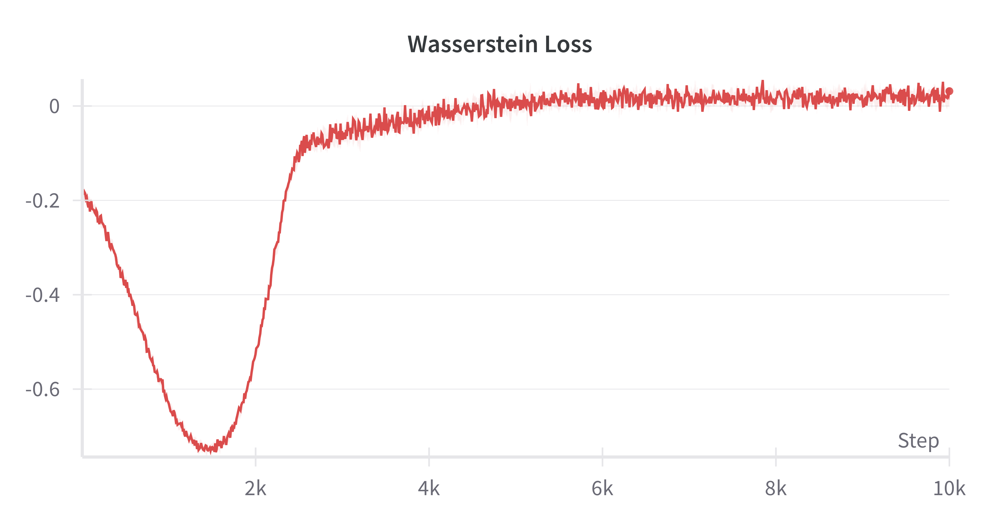
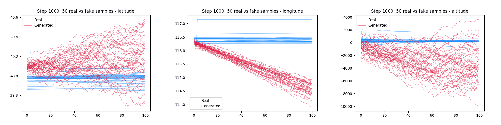
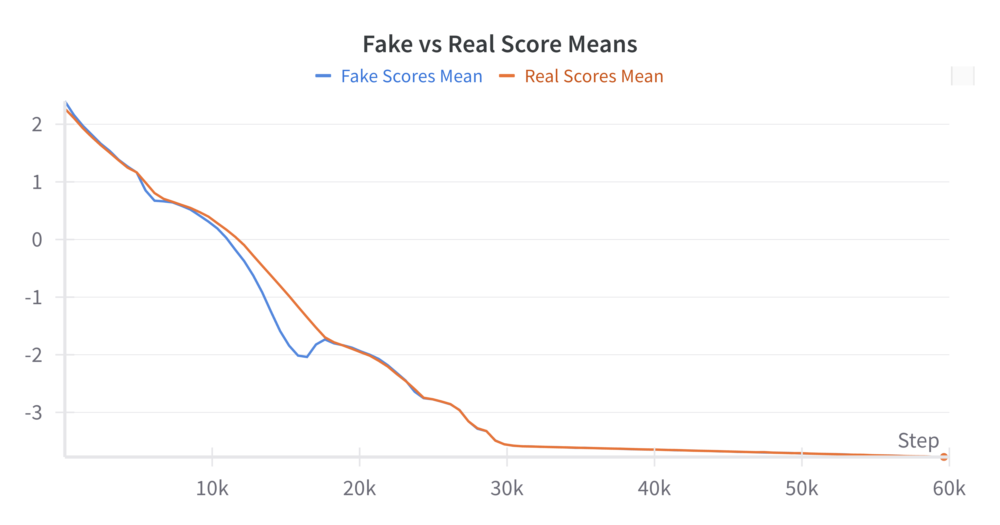
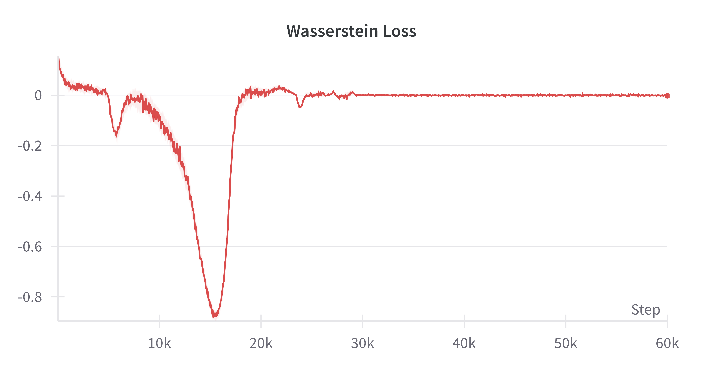

# Infinite GANs Progress Demo

This document presents a concise overview of the current progress and capabilities of Infinite GANs. Each example demonstrates how the model learns to generate synthetic time-series data across different domains, with training visualizations and performance metrics logged to Weights & Biases (W&B).

## Basic Example: [Ornstein-Uhlenbeck Process](./datasets.md#11-ornsteinuhlenbeck-process)

As a foundational test, Infinite GAN is trained to learn the Ornstein-Uhlenbeck (OU) process—a classic mean-reverting stochastic process commonly used in time-series modeling. This benchmark provides insight into the model’s ability to capture simple temporal dynamics.

Run the following command from the project root:

```bash
python -m src.run --use_wandb --online
```

The model is trained for 10,000 steps using batches of 1,024 samples, each consisting of 128 time steps. The entire training process completed in 4 hours and 7 minutes on TACC's Vista server. During training, Infinite GAN generates synthetic samples every 1,000 steps, allowing us to monitor its learning progression.

<p align="center">
  
  <i style="color:gray;"><br>Fig. 1) Comparison of real vs fake samples from the Ornstein-Uhlenbeck process</i>
</p>

The synthetic samples increasingly resemble the real samples as training progresses. This is reflected in the discriminator's scores for the fake and real samples as shown below:

<p align="center">
  
  <i style="color:gray;"><br>Fig. 2) Discriminator scores for real vs fake samples</i>
</p>

Taking the difference of the scores gives the Wasserstein loss. The evolution of the Wasserstein loss is shown below:

<p align="center">
  
  <i style="color:gray;"><br>Fig. 3) Wasserstein loss over training steps</i>
</p>

Convergence is typically observed around step 3,000, where real and fake discriminator scores align and Wasserstein loss approaches zero. This suggests the discriminator struggles to differentiate between real and fake distributions, which is an indicator of learning success for this simple process.

## Testing Dataset: [Google Stock](./datasets.md#12-google-stock)

6 features of daily stock market data for Google from 2004 to 2022. This run used the simplified training setup (`basic` logic) from the `torchsde` example for improved stability. Training completed in 45 minutes on TACC's Vista server.

Run the following command from the project root:

```bash
python -m src.run --use_wandb --online --cfg_name=google_basic
```

The model is trained for 10,000 steps using batches of 1,024 samples, each consisting of 24 time steps. During training, Infinite GAN generates synthetic samples every 1,000 steps, allowing us to monitor its learning progression. 3 of the 6 features are shown below:

<p align="center">
  
  <i style="color:gray;"><br>Fig. 4) Comparison of real vs fake samples of 3 Google stock features</i>
</p>

The samples exhibit somewhat similar overall trends but are too volatile, failing to capture the structured patterns present in the real data. This can be further understood by looking at the discriminator scores and loss graphs:

<p align="center">
  
  <i style="color:gray;"><br>Fig. 5) Discriminator scores for real vs fake samples</i>
</p>

<p align="center">
  
  <i style="color:gray;"><br>Fig. 6) Wasserstein loss over training steps</i>
</p>

Although discriminator scores and Wasserstein loss show early convergence, this is not indicative of accurate imitation. The fake samples stabilize in form, but diverge from real sample characteristics.

## Urban Datatset: [Geolife](./datasets.md#21-geolife)

Latitude, longitude, and altitude GPS coordinate trajectories. The dataset was filtered to contain only trajectories in Beijing, China with at least 100 data points (14,702 trajectories).

Run the following command from the project root:

```bash
python -m src.run --use_wandb --online --cfg_name=geolife
```

The model is trained for 10,000 steps using batches of 1,024 samples, each consisting of 100 time steps. This run used an expanded training regime, with five discriminator updates per generator update. This increases the effective number of training steps logged to W&B (10,000 steps become 60,000 steps). The entire training process completed in 12 hours and 53 minutes on TACC's Vista server. During training, Infinite GAN generates synthetic samples every 1,000 steps (every 6,000 effective steps), allowing us to monitor its learning progression.

<p align="center">
  
  <i style="color:gray;"><br>Fig. 7) Comparison of real vs fake samples of Geolife features</i>
</p>

The same issue is still apparent here. Although there is a certain degree of learning the real samples, it is very limited and doesn't result in very realistic fake samples.

> **Note**: Due to the 5:1 discriminator-to-generator update ratio, the x-axis steps on W&B plots are scaled 6x compared to actual generator updates.

| 10k scale | 1,000 | 2,000  | 3,000  | 4,000  | 5,000  | 6,000  | 7,000  | 8,000  | 9,000  | 10,000 |
| --------- | ----- | ------ | ------ | ------ | ------ | ------ | ------ | ------ | ------ | ------ |
| 60k scale | 6,000 | 12,000 | 18,000 | 24,000 | 30,000 | 36,000 | 42,000 | 48,000 | 54,000 | 60,000 |

<p align="center">
  
  <i style="color:gray;"><br>Fig. 8) Discriminator scores for real vs fake samples</i>
</p>

<p align="center">
  
  <i style="color:gray;"><br>Fig. 9) Wasserstein loss over training steps</i>
</p>

Despite convergence in Wasserstein loss, sample quality remains poor. Discriminator scores continue to decline, and the model fails to generate realistic trajectories.

## Conclusion

With the current testing progress, a few key points have been identified:

-   The discriminator fails to robustly distinguish noisy fake samples from cleaner real samples.
-   Generated sequences remain overly noisy throughout training.
-   Most learning occurs early (by step ~3,000), after which performance plateaus.
